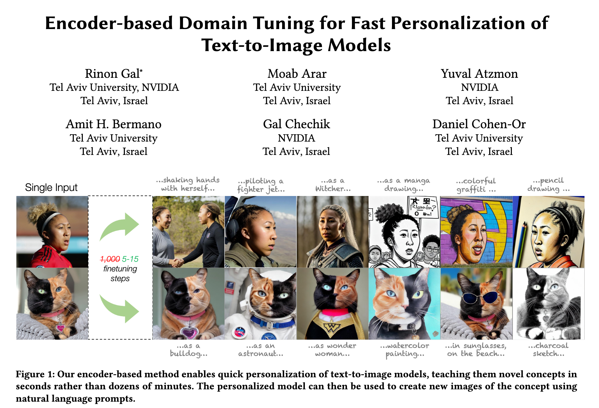

# E4T-diffusion
An implementation of [Encoder-based Domain Tuning for Fast Personalization of Text-to-Image Models](https://arxiv.org/abs/2302.12228) by using d🧨ffusers. 

My summary tweet is found [here](https://twitter.com/mk1stats/status/1630891691623448576).



## Installation
```
$ git clone https://github.com/mkshing/e4t-diffusion.git
$ cd e4t-diffusion
$ pip install -r requirements.txt
```

## Pre-training
Needs a >40GB GPU at least. 
```
accelerate launch pretrain_e4t.py \
  --pretrained_model_name_or_path="runwayml/stable-diffusion-v1-5" \
  --clip_model_name_or_path="openai/clip-vit-large-patch14" \
  --domain_class_token="art" \
  --placeholder_token="*s" \
  --prompt_template="a photo of {placeholder_token}" \
  --reg_lambda=0.01 \
  --output_dir="pretrained-art" \
  --train_image_dataset="Artificio/WikiArt" \
  --iterable_dataset \
  --resolution=512 \
  --train_batch_size=16 \
  --learning_rate=1.6e-5 \
  --max_train_steps=100_000 \
  --mixed_precision="fp16" \
  --enable_xformers_memory_efficient_attention \
  --use_8bit_adam
```

## Domain-tuning

```
accelerate launch tuning_e4t.py \
  --pretrained_model_name_or_path="e4t pre-trained model path" \
  --reg_lambda=0.1 \
  --output_dir="path-to-save-model" \
  --train_image_path="image path or url" \
  --resolution=512 \
  --train_batch_size=16 \
  --learning_rate=5.e-6 \
  --max_train_steps=15 \
  --mixed_precision="fp16" \
  --enable_xformers_memory_efficient_attention \
  --use_8bit_adam
```


## Inference
```
python inference.py \
  --pretrained_model_name_or_path "e4t pre-trained model path" \
  --prompt "a photo of *s" \
  --image_path_or_url "image path or url" \
  --device "cpu or cuda" \
  --num_inference_steps 50 \
  --guidance_scale 5.0
```


## Citation

```bibtex
@misc{https://doi.org/10.48550/arXiv.2302.12228,
    url     = {https://arxiv.org/abs/2302.12228},
    author  = {Rinon Gal, Moab Arar, Yuval Atzmon, Amit H. Bermano, Gal Chechik, Daniel Cohen-Or},  
    title   = {Encoder-based Domain Tuning for Fast Personalization of Text-to-Image Models},
    publisher = {arXiv},
    year    = {2023},
    copyright = {arXiv.org perpetual, non-exclusive license}
}
```

## TODO
- [x] Pre-training
- [x] Domain-tuning
- [x] Inference
- [ ] Use an off-the-shelf face segmentation network for human face domain.
   > Finally, we find that for the human face domain, it is helpful to
use an off-the-shelf face segmentation network [Deng et al. 2019]
to mask the diffusion loss at this stage.
